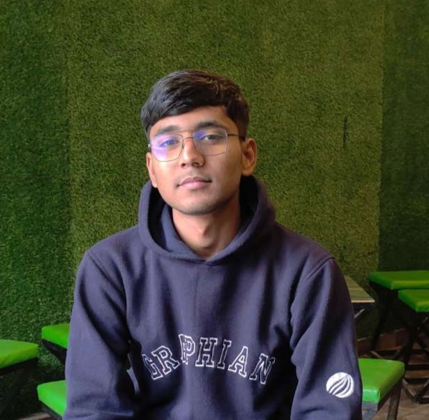

# 🌐 Aditya Patwal - Portfolio Website

Welcome to the personal portfolio of **Aditya Patwal** — a B.Tech Computer Science and Engineering student at Graphic Era Hill University, Dehradun. This website highlights my skills, projects, and journey in tech.

## 🚀 About Me

I'm a goal-oriented and adaptable developer passionate about technology, problem-solving, and AI. I enjoy building practical tools that merge creativity with technical skill — from emotion-based apps to gesture-controlled UIs.

---

## 💡 Features

- Responsive single-page design (HTML + CSS)
- Modern UI/UX with smooth transitions
- Cleanly categorized:
  - About Me
  - Technical Skills
  - Projects (AI, ML, CV, Speech)
  - Education
  - Contact & Socials

---

## 🔨 Tech Stack

- HTML5
- CSS3
- Responsive Design Principles
- Basic Tailwind (planned)
- GitHub Pages for Deployment

---

## 🧠 Projects Highlighted

| Project | Tech | Description |
|--------|------|-------------|
| **MoodSync** | Python, Flask, OpenCV | Emotion-based media recommender using facial analysis |
| **Gesture Mouse** | OpenCV, MediaPipe | AI-powered virtual mouse with hand tracking |
| **Speech Recognition Assistant** | Python, Tkinter | Voice-based assistant with Google Speech API |

---

## 📚 Education

- **B.Tech in CSE**, GEHU Dehradun (Nov 2021 – June 2025)
- Vision Valley School, Kashipur (CBSE 10th & 12th)

---

## 📫 Connect With Me

- 📧 Email: [adityapatwal2.0@gmail.com](mailto:adityapatwal2.0@gmail.com)
- 🔗 LinkedIn: [linkedin.com/in/paditya20](https://linkedin.com/in/paditya20)
- 🧑‍💻 GitHub: [github.com/Adit020](https://github.com/Adit020)

---

## 🔗 Live Demo

🌍 [Visit My Portfolio](https://<your-github-username>.github.io/<repo-name>)  
(*Replace the link after deployment*)

---

## 📌 License

This project is open source and available under the [MIT License](LICENSE).

---

> ⚡ Always learning. Always building. Let's connect and collaborate!
